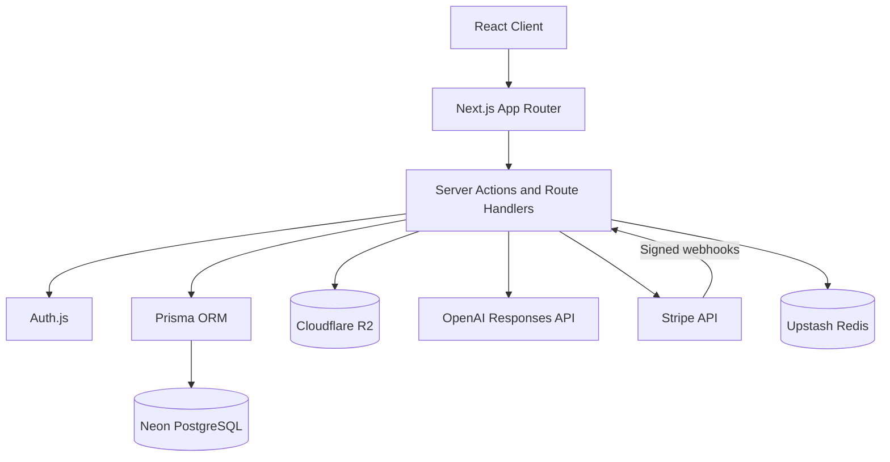

# DevStash

DevStash is a centralized developer knowledge hub for the code snippets, AI prompts, notes, commands, files, URLs, and project context developers reuse every day.

The product goal is simple: give developers one fast, searchable, AI-enhanced workspace for storing and organizing reusable technical knowledge instead of scattering it across editors, bookmarks, chat history, gists, local folders, and documentation tools.

## Core Concepts

### Items

An item is the primary unit of saved knowledge. Items can represent:

- Code snippets
- AI prompts
- Markdown notes
- Terminal commands
- Uploaded files
- Images
- URLs or bookmarks
- Project context documents

### Item Types

DevStash includes these built-in item types:

| Type | Purpose |
| --- | --- |
| Snippet | Reusable code blocks |
| Prompt | AI prompts and workflows |
| Note | Markdown notes and explanations |
| Command | CLI commands and scripts |
| File | Uploaded documents and templates |
| Image | Screenshots, diagrams, and visual references |
| Link | Bookmarks and external resources |

Custom item types are planned for Pro users.

### Collections

Collections group related items and can contain mixed item types. Examples include React Patterns, Context Files, Python Snippets, Next.js Boilerplates, Prompt Engineering, and Useful CLI Commands.

### Tags

Tags provide flexible cross-cutting organization across collections and item types, such as `react`, `nextjs`, `auth`, `prisma`, `prompt`, `debugging`, and `performance`.

## Implemented Features

### Knowledge workflow

- Create, view, edit, copy, and delete items through authenticated server actions and an item detail drawer.
- Use purpose-built views for every built-in item type:
  - Monaco editing and live language-aware syntax highlighting for snippets and commands.
  - GitHub Flavored Markdown write/preview modes for notes and prompts.
  - Drive-style rows for files and a responsive thumbnail gallery for images.
  - URL fields and previews for saved links.
- Add tags, descriptions, and zero or more collection assignments to an item.
- Upload files and images to Cloudflare R2 through authenticated, validated, single-use upload records.
- Download files and preview images through ownership-checked application routes.

### Organization and discovery

- Create, browse, edit, and delete collections without deleting their items.
- Browse dedicated collection and item-type pages using the same cards, drawers, and creation flows as the dashboard.
- Navigate with a fixed, collapsible desktop sidebar or responsive mobile drawer populated from the database.
- Search items and collections from dashboard, item-list, and collection views with the `Cmd+K` / `Ctrl+K` command palette and user-scoped fuzzy filtering.
- Copy the most relevant item content directly from supported cards.

### AI features

Active Pro users can:

- Generate normalized tag suggestions from the current unsaved item content.
- Generate concise item descriptions from title, content, type, language, URL, tags, and file context.

Both features use the OpenAI Responses API with `gpt-5-nano`, server-side access checks, validation, provider-error handling, and separate per-user rate limits.

### Authentication and account security

- Sign in with GitHub OAuth or email and password through Auth.js.
- Register with bcrypt-hashed passwords and optional Resend email verification.
- Recover accounts through forgot-password and reset-password flows.
- Protect authentication endpoints with Upstash sliding-window rate limits.
- Change passwords and delete accounts from the protected profile/settings page.
- Cancel a live Stripe subscription before account deletion so recurring billing is not orphaned.

### Billing and entitlements

- Upgrade through Stripe-hosted Checkout at **€7/month** or **€72/year**.
- Manage or cancel subscriptions through Stripe’s Customer Portal with automatic return-time reconciliation.
- Display active, past-due, canceling, canceled, renewal, and access-end states on the profile page.
- Synchronize canonical Stripe state through signed, idempotent webhooks that tolerate duplicate and out-of-order delivery.
- Recognize both Stripe `cancel_at_period_end` and explicit `cancel_at` scheduled cancellations.
- Enforce database-backed Free limits of 50 items and 3 collections, including protection against concurrent over-limit creates.
- Grant unlimited item and collection quotas—and access to rate-limited AI actions and file/image uploads—only to `PRO + ACTIVE` accounts.
- Retain stored records after downgrade while enforcing current-plan gates on Pro-only routes and new restricted operations.

### Application experience

- Responsive marketing homepage with product preview, feature grid, pricing, calls to action, and shared DevStash branding.
- Generated DevStash logo favicon derived from the HTML/CSS logo mark.
- Persistent light and dark themes across public, authentication, dashboard, editor, and settings surfaces.
- Responsive dashboard with database-backed stats, recent collections, and recent items.
- Compact profile/settings header with shared dashboard sidebar, mobile navigation, billing usage, and account controls.
- Loading, error, toast, validation, keyboard, and screen-reader feedback across primary flows.

## Main Routes

| Route | Purpose |
| --- | --- |
| `/` | Public DevStash marketing homepage |
| `/sign-in`, `/register` | Custom Auth.js sign-in and registration |
| `/forgot-password`, `/reset-password`, `/verify-email` | Account recovery and verification |
| `/dashboard` | Authenticated overview and creation workspace |
| `/items/[type]` | Type-specific item lists and editors |
| `/collections` | User collection grid |
| `/collections/[id]` | Collection details, actions, and contained items |
| `/profile` | Profile, billing, usage, password, and account settings |
| `/api/webhooks/stripe` | Signed Stripe subscription lifecycle webhook |

## Tech Stack

| Category | Choice |
| --- | --- |
| Framework | Next.js 16.2 with App Router |
| UI Runtime | React 19 |
| Language | TypeScript 5 |
| Styling | Tailwind CSS 4 |
| UI Components | shadcn/ui, Base UI, Sonner |
| Editors | Monaco Editor, React Markdown, Remark GFM |
| Icons | Lucide React |
| Database | Neon PostgreSQL |
| ORM | Prisma 7 with `@prisma/adapter-pg` |
| Auth | NextAuth/Auth.js v5 |
| File Storage | Cloudflare R2 |
| AI | OpenAI Responses API with `gpt-5-nano` |
| Payments | Stripe Checkout, Customer Portal, and webhooks |
| Rate Limiting | Upstash Redis |
| Testing | Vitest with V8 coverage |
| Deployment | Vercel |

## Getting Started

Install dependencies and create a local environment file:

```bash
npm install
cp .env.example .env
```

Configure the services needed for the features you want to run:

| Variables | Purpose |
| --- | --- |
| `DATABASE_URL` | PostgreSQL/Neon application database |
| `SHADOW_DATABASE_URL` | Optional separate Prisma Migrate shadow database |
| `AUTH_SECRET`, `AUTH_GITHUB_ID`, `AUTH_GITHUB_SECRET` | Auth.js session security and GitHub OAuth |
| `APP_URL` | Canonical public origin used for email and Stripe return URLs |
| `EMAIL_VERIFICATION_ENABLED` | Set to `false` to bypass verification during local development |
| `RESEND_API_KEY`, `RESEND_FROM_EMAIL` | Verification and password-reset emails |
| `UPSTASH_REDIS_REST_URL`, `UPSTASH_REDIS_REST_TOKEN` | Authentication and AI rate limiting |
| `R2_ACCOUNT_ID`, `R2_ACCESS_KEY_ID`, `R2_SECRET_ACCESS_KEY`, `R2_BUCKET_NAME` | File and image storage |
| `OPENAI_API_KEY` | AI tag and description generation |
| `STRIPE_SECRET_KEY`, `STRIPE_WEBHOOK_SECRET` | Stripe server API and signed webhook verification |
| `STRIPE_PRICE_ID_MONTHLY`, `STRIPE_PRICE_ID_YEARLY` | Trusted recurring DevStash Pro Price IDs |

Email verification is enabled by default. Set the following when Resend is not configured for local development:

```bash
EMAIL_VERIFICATION_ENABLED=false
```

Prepare and seed the database:

```bash
npm run prisma:generate
npm run db:migrate
npm run db:seed
```

Start the development server:

```bash
npm run dev
```

Open [http://localhost:3000](http://localhost:3000) for the homepage or [http://localhost:3000/dashboard](http://localhost:3000/dashboard) for the authenticated workspace.

For local Stripe lifecycle testing, forward Sandbox events to the webhook route and copy the CLI-provided signing secret into `STRIPE_WEBHOOK_SECRET`:

```bash
stripe listen --forward-to localhost:3000/api/webhooks/stripe
```

Use Stripe test-mode keys and Price IDs for local development. Do not mix test and live Stripe resources.

## Scripts

| Command | Description |
| --- | --- |
| `npm run dev` | Start the Next.js development server |
| `npm run build` | Create a production build |
| `npm run start` | Start the production server |
| `npm run lint` | Run ESLint |
| `npm run test` | Run Vitest tests once |
| `npm run test:watch` | Run Vitest in watch mode |
| `npm run test:coverage` | Run Vitest with V8 coverage |
| `npm run prisma:generate` | Generate the Prisma client |
| `npm run db:migrate` | Create/apply Prisma migrations in development |
| `npm run db:studio` | Open Prisma Studio without launching a browser |
| `npm run db:seed` | Seed the demo user, item types, collections, and items |
| `npm run db:test` | Verify database connectivity and demo seed data |
| `npm run db:delete-non-demo-users` | Run the dry-run-first non-demo-user cleanup helper |

## Project Structure

```text
src/
  actions/
    ai.ts                       Pro AI tag and description actions
    billing.ts                  Checkout, Portal, and billing reconciliation
    collections.ts              Collection mutations
    items.ts                    Item mutations
  app/
    (auth)/                     Sign-in, registration, verification, and recovery pages
    api/
      auth/                     Auth.js and auth lifecycle handlers
      items/[id]/               Item detail, download, and preview routes
      profile/                  Password and account routes
      uploads/                  Authenticated R2 upload/delete route
      webhooks/stripe/          Signed Stripe webhook route
    collections/                Collection grid and detail routes
    dashboard/                  Authenticated dashboard, loading, and error UI
    items/[type]/               Typed item list routes
    profile/                    Profile, billing, and account settings
    icon.tsx                    Generated DevStash app icon
    layout.tsx                  Root metadata, fonts, theme, and toast providers
    page.tsx                    Marketing homepage
  components/
    auth/                       Auth forms and shared auth shell
    collections/                Collection grids, detail views, and actions
    dashboard/                  Shell, sidebar, search, cards, editors, drawers, and forms
    homepage/                   Marketing homepage and shared logo components
    items/                      File rows, image cards, and typed item list shell
    profile/                    Profile shell, billing card, and account actions
    ui/                         Shared shadcn-style primitives
  features/dashboard/           Dashboard types, data adapters, and presentation utilities
  generated/prisma/             Generated Prisma client
  lib/
    ai/                         OpenAI client and Pro access checks
    auth/                       Authentication helpers
    billing/                    Database-backed entitlements
    db/                         Prisma queries and persistence helpers
    email/                      Resend integration
    storage/                    Cloudflare R2 integration
    stripe/                     Stripe client, config, events, and canonical synchronization
    file-uploads.ts             Upload validation and metadata
    item-type-capabilities.ts   Type-specific capabilities and gates
    rate-limit.ts               Upstash rate-limit helper
    usage-limits.ts             Free and Pro quota policy

prisma/
  schema.prisma                 Application and billing schema
  seed.ts                       Free-tier demo data
  migrations/                   Core, uploads, collection membership, and billing migrations

context/
  project-overview.md           Product and architecture overview
  current-feature.md            Feature tracker and implementation history
  coding-standards.md           Project conventions
  features/                     Feature specifications
  research/                     Research notes
  screenshots/                  Reference screenshots

scripts/
  delete-non-demo-users.ts      Dry-run-first account cleanup helper
  test-db.ts                    Database smoke test
```

## Entitlement and Security Model

- Authentication identifies the user; paid authorization always comes from the current database billing snapshot.
- Stripe-hosted success URLs never grant Pro. Checkout reconciliation verifies ownership, and signed webhooks remain the lifecycle source of truth.
- Unknown Stripe prices, unsupported subscription shapes, and non-active billing states fail closed.
- Item, collection, upload, AI, and account-deletion rules are enforced server-side even when the UI also explains or disables an action.
- Every item, collection, file, profile, and billing operation is scoped to the authenticated user.
- Downgrades do not delete existing data; current entitlements still control Pro-only routes and operations.

## Architecture



## Verification

The repository includes focused Vitest coverage for server actions, database helpers, authentication utilities, uploads/downloads, AI access, rate limits, billing entitlements, Checkout/Portal actions, webhook signatures, and canonical Stripe synchronization.

Run the standard verification suite before merging:

```bash
npm run test
npx tsc --noEmit
npm run lint
npm run build
git diff --check
```

## Documentation

The main product and technical planning documents live in `context/` and `docs/`:

- `context/project-overview.md`
- `context/current-feature.md`
- `context/coding-standards.md`
- `context/features/database-spec.md`
- `context/features/dashboard-phase-1-spec.md`
- `context/features/dashboard-phase-2-spec.md`
- `context/features/dashboard-phase-3-spec.md`
- `context/features/item-list-view-spec.md`
- `context/features/item-drawer-spec.md`
- `context/features/item-drawer-edit-spec.md`
- `context/features/item-create-spec.md`
- `context/features/code-editor-spec.md`
- `context/features/markdown-editor-spec.md`
- `context/features/file-image-spec.md`
- `context/features/profile-spec.md`
- `context/features/rate-limiting-spec.md`
- `context/features/stripe-phase-1-spec.md`
- `context/features/stripe-phase-2-spec.md`
- `docs/stripe-integration-plan.md`
