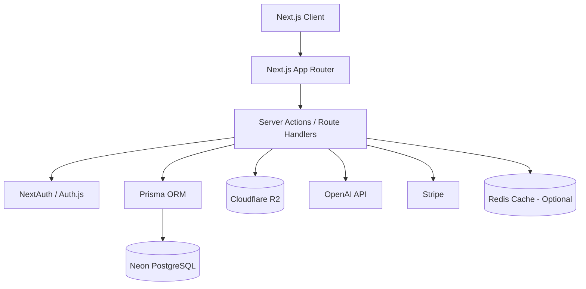
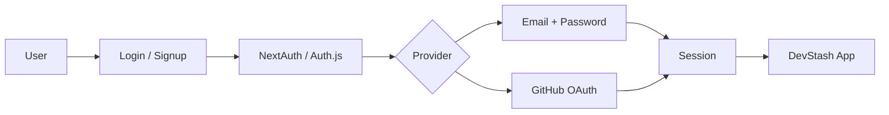
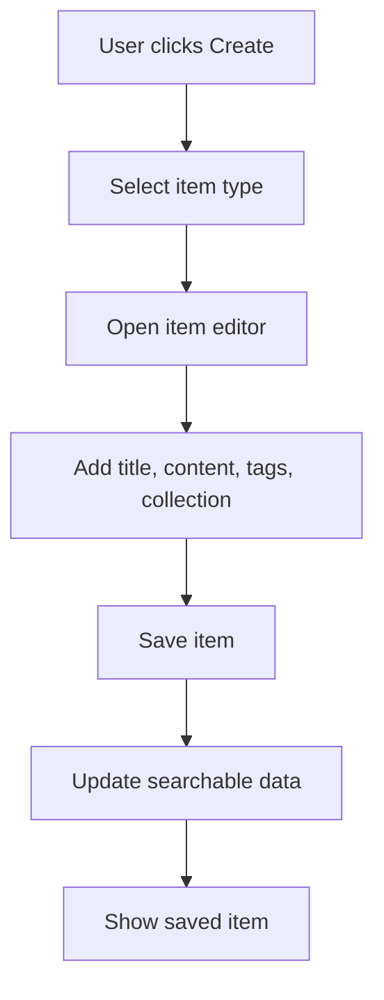
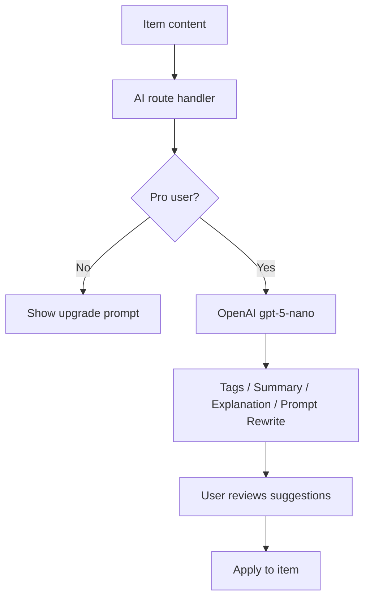
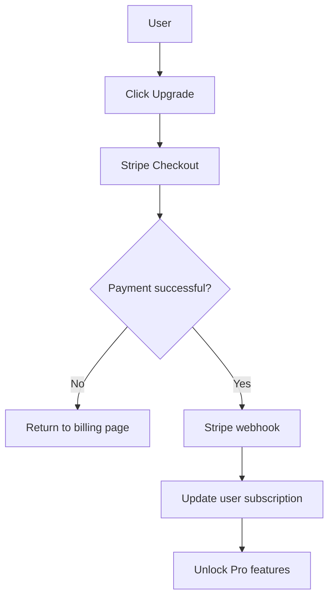

# DevStash Project Overview

> **Centralized Developer Knowledge Hub** for code snippets, AI prompts, documentation, commands, files, URLs, and reusable developer resources.

---

## 1. Product Summary

**DevStash** is a SaaS product that gives developers one searchable, AI-enhanced place to store and organize the knowledge they reuse every day.

Developers often keep important resources scattered across tools such as VS Code, Notion, browser bookmarks, terminal history, chat conversations, GitHub gists, local files, and random project folders. This creates friction, context switching, duplicated effort, and lost knowledge.

DevStash solves this by offering a focused developer workspace for saving, searching, editing, tagging, importing, exporting, and eventually enhancing resources with AI.

---

## 2. Core Problem

Developers commonly store reusable knowledge in too many disconnected places:

- Code snippets in editors, notes, or gists
- AI prompts in chat history
- Project context files buried in repositories
- Useful links in browser bookmarks
- Documentation in folders, wikis, or Notion pages
- Terminal commands in shell history or text files
- Boilerplates and templates across GitHub, local folders, and notes

This leads to:

- Slow retrieval
- Repeated context switching
- Inconsistent workflows
- Lost or duplicated knowledge
- Poor reuse of prompts, snippets, and project context

**DevStash provides one searchable, AI-enhanced hub for developer knowledge and resources.**

---

## 3. Target Users

| Persona | Description | Main Needs |
|---|---|---|
| Everyday Developer | Developers who reuse snippets, commands, links, and docs | Fast access, search, favorites, organization |
| AI-First Developer | Developers using AI tools heavily in daily work | Prompt storage, context files, reusable workflows |
| Content Creator / Educator | Developers creating tutorials, courses, demos, or technical content | Reusable examples, notes, references, teaching material |
| Full-Stack Builder | Indie hackers and product engineers building across the stack | Boilerplates, API references, patterns, project templates |

---

## 4. Product Positioning

**One-line pitch:**

> DevStash is a searchable, AI-powered stash for everything developers reuse.

**Possible tagline:**

> Store smarter. Build faster.

**Comparable inspirations:**

- Notion for flexible organization
- Raycast for fast command-style access
- Linear for a clean, focused developer experience
- GitHub Gists for code-oriented storage
- Snippet managers for reusable code patterns

---

## 5. Core Concepts

### 5.1 Item

An **Item** is the primary unit of saved knowledge.

Examples:

- Code snippet
- AI prompt
- Markdown note
- Terminal command
- Uploaded file
- Image
- URL/bookmark
- Project context document

### 5.2 Item Type

An **Item Type** defines what kind of resource an item is.

Built-in system types:

| Type | Suggested Icon | Use Case |
|---|---:|---|
| Snippet | `Code2` | Reusable code blocks |
| Prompt | `Sparkles` | AI prompts and workflows |
| Note | `FileText` | Markdown notes and explanations |
| Command | `Terminal` | CLI commands and scripts |
| File | `File` | Uploaded documents and templates |
| Image | `Image` | Screenshots, diagrams, visual references |
| URL | `Link` | Bookmarks and external resources |

Custom item types can be unlocked for Pro users.

### 5.3 Collection

A **Collection** groups related items. Collections can contain mixed item types.

Examples:

- React Patterns
- Context Files
- Python Snippets
- Next.js Boilerplates
- Prompt Engineering
- Useful CLI Commands

### 5.4 Tag

A **Tag** provides flexible cross-cutting organization.

Examples:

- `react`
- `nextjs`
- `auth`
- `prisma`
- `prompt`
- `debugging`
- `performance`

---

## 6. MVP Scope

### Must Have

- Authentication
- Item CRUD
- Built-in item types
- Collections
- Tags
- Favorites
- Pinned items
- Basic full-text search
- Markdown editor for text-based items
- Syntax highlighting for snippets
- Free tier limits
- Dark mode-first UI

### Should Have

- Recently used items
- File uploads
- URL metadata extraction
- Import from files
- Export to JSON
- Basic AI auto-tagging for Pro users

### Later

- Shared collections
- Team/org plans
- Browser extension
- VS Code extension
- Public API
- CLI tool
- Advanced semantic search
- Prompt versioning
- Snippet variables/placeholders

---

## 7. Feature Breakdown

### 7.1 Items

Supported item fields:

- Title
- Type
- Content
- Description
- Language
- URL
- File metadata
- Collection
- Tags
- Favorite state
- Pinned state
- Created date
- Updated date

### 7.2 Search

Search should work across:

- Item title
- Item content
- Description
- Tags
- Item type
- Collection name
- Programming language

Recommended MVP search strategy:

1. Start with PostgreSQL full-text search.
2. Add filters by type, collection, tags, favorites, and pinned state.
3. Later add semantic/vector search for AI-enhanced retrieval.

### 7.3 Authentication

Supported authentication methods:

- Email + password
- GitHub OAuth

Recommended provider:

- NextAuth/Auth.js v5

### 7.4 File Uploads

Supported file use cases:

- Images
- Docs
- Templates
- Markdown files
- JSON exports/imports
- Project context files

Recommended storage:

- Cloudflare R2

### 7.5 AI Features

AI-powered functionality for Pro users:

- Auto-tagging
- AI summaries
- Explain code
- Prompt optimization
- Suggested collections
- Search query enhancement

AI provider:

- OpenAI `gpt-5-nano`

---

## 8. User Experience

### 8.1 Design Direction

- Dark mode first
- Minimal and developer-focused
- Fast keyboard-friendly interactions
- Clean sidebar-based layout
- Syntax highlighting for code
- Markdown-first editing experience
- Clear visual distinction between item types

### Screenshots

Refer to the screenshots bellow as a base for the dashboard UI. It doesnt have to be exact. Use it as a refernce:

@context/screenshots/dashboard-ui-main.png
@context/screenshots/dashboard-ui-item-drawer.png


### 8.2 Main Layout

```text
+-------------------------------------------------------+
| Top Bar: Search, Create, Account, Upgrade             |
+----------------------+--------------------------------+
| Sidebar              | Main Workspace                 |
|                      |                                |
| - All Items          | Item grid/list                  |
| - Favorites          | Search results                  |
| - Pinned             | Collection contents             |
| - Recent             |                                |
| - Collections        |                                |
| - Tags               |                                |
| - Types              |                                |
+----------------------+--------------------------------+
```

### 8.3 Item Editor

The item editor should support:

- Full-screen mode
- Split preview for Markdown
- Code syntax highlighting
- Metadata panel
- Collection assignment
- Tag management
- Favorite/pin actions
- AI actions for Pro users

### 8.4 Responsive Behavior

- Sidebar becomes a mobile drawer
- Primary create action remains visible
- Item cards should be touch-friendly
- Editor should use a focused single-column layout on small screens

---

## 9. Suggested Navigation Structure

| Route | Purpose |
|---|---|
| `/` | Marketing landing page |
| `/login` | Sign in |
| `/signup` | Create account |
| `/app` | Main authenticated dashboard |
| `/app/items` | All items |
| `/app/items/new` | Create item |
| `/app/items/[id]` | View/edit item |
| `/app/collections` | Collections overview |
| `/app/collections/[id]` | Collection detail |
| `/app/tags` | Tag management |
| `/app/settings` | Account and preferences |
| `/app/billing` | Subscription and plan management |

---

## 10. Technical Stack

| Category | Choice |
|---|---|
| Framework | Next.js with React 19 |
| Language | TypeScript |
| Database | Neon PostgreSQL |
| ORM | Prisma |
| Auth | NextAuth/Auth.js v5 |
| File Storage | Cloudflare R2 |
| UI | Tailwind CSS v4 + shadcn/ui |
| Icons | lucide-react |
| AI | OpenAI `gpt-5-nano` |
| Payments | Stripe |
| Deployment | Vercel |
| Monitoring | Sentry later |
| Caching | Redis optional |
| CI | GitHub Actions optional |

---

## 11. Architecture Overview



---

## 12. Auth Flow



---

## 13. Item Creation Flow



---

## 14. AI Feature Flow



---

## 15. Billing Flow



---

## 16. Prisma Data Model

> This schema is a refined starting point and should evolve as the product matures.

```prisma
enum ItemContentType {
  TEXT
  FILE
  URL
}

enum SubscriptionPlan {
  FREE
  PRO
}

enum SubscriptionStatus {
  INACTIVE
  ACTIVE
  PAST_DUE
  CANCELED
}

model User {
  id                   String             @id @default(cuid())
  email                String             @unique
  name                 String?
  image                String?
  passwordHash         String?

  plan                 SubscriptionPlan   @default(FREE)
  subscriptionStatus   SubscriptionStatus @default(INACTIVE)
  stripeCustomerId     String?            @unique
  stripeSubscriptionId String?            @unique

  items                Item[]
  itemTypes            ItemType[]
  collections          Collection[]
  tags                 Tag[]

  createdAt            DateTime           @default(now())
  updatedAt            DateTime           @updatedAt
}

model Item {
  id           String          @id @default(cuid())
  title        String
  description  String?
  contentType  ItemContentType
  content      String?
  language     String?

  url          String?
  fileUrl      String?
  fileName     String?
  fileMimeType String?
  fileSize     Int?

  isFavorite   Boolean         @default(false)
  isPinned     Boolean         @default(false)
  lastUsedAt   DateTime?

  userId       String
  user         User            @relation(fields: [userId], references: [id], onDelete: Cascade)

  typeId       String
  type         ItemType        @relation(fields: [typeId], references: [id])

  collectionId String?
  collection   Collection?     @relation(fields: [collectionId], references: [id], onDelete: SetNull)

  tags         ItemTag[]

  createdAt    DateTime        @default(now())
  updatedAt    DateTime        @updatedAt

  @@index([userId])
  @@index([typeId])
  @@index([collectionId])
  @@index([isFavorite])
  @@index([isPinned])
}

model ItemType {
  id        String   @id @default(cuid())
  name      String
  slug      String
  icon      String?
  color     String?
  isSystem  Boolean  @default(false)

  userId    String?
  user      User?    @relation(fields: [userId], references: [id], onDelete: Cascade)

  items     Item[]

  createdAt DateTime @default(now())
  updatedAt DateTime @updatedAt

  @@unique([userId, slug])
  @@index([isSystem])
}

model Collection {
  id          String   @id @default(cuid())
  name        String
  slug        String
  description String?
  isFavorite  Boolean  @default(false)

  userId      String
  user        User     @relation(fields: [userId], references: [id], onDelete: Cascade)

  items       Item[]

  createdAt   DateTime @default(now())
  updatedAt   DateTime @updatedAt

  @@unique([userId, slug])
  @@index([userId])
}

model Tag {
  id        String    @id @default(cuid())
  name      String
  slug      String

  userId    String
  user      User      @relation(fields: [userId], references: [id], onDelete: Cascade)

  items     ItemTag[]

  createdAt DateTime  @default(now())
  updatedAt DateTime  @updatedAt

  @@unique([userId, slug])
  @@index([userId])
}

model ItemTag {
  itemId String
  tagId  String

  item   Item @relation(fields: [itemId], references: [id], onDelete: Cascade)
  tag    Tag  @relation(fields: [tagId], references: [id], onDelete: Cascade)

  @@id([itemId, tagId])
}
```

---

## 17. System Item Type Seed Data

```ts
export const SYSTEM_ITEM_TYPES = [
  {
    name: 'Snippet',
    slug: 'snippet',
    icon: 'Code2',
    color: 'blue',
    isSystem: true,
  },
  {
    name: 'Prompt',
    slug: 'prompt',
    icon: 'Sparkles',
    color: 'purple',
    isSystem: true,
  },
  {
    name: 'Note',
    slug: 'note',
    icon: 'FileText',
    color: 'zinc',
    isSystem: true,
  },
  {
    name: 'Command',
    slug: 'command',
    icon: 'Terminal',
    color: 'green',
    isSystem: true,
  },
  {
    name: 'File',
    slug: 'file',
    icon: 'File',
    color: 'orange',
    isSystem: true,
  },
  {
    name: 'Image',
    slug: 'image',
    icon: 'Image',
    color: 'pink',
    isSystem: true,
  },
  {
    name: 'URL',
    slug: 'url',
    icon: 'Link',
    color: 'cyan',
    isSystem: true,
  },
] as const;
```

---

## 18. Suggested App Folder Structure

```txt
src/
  app/
    (marketing)/
      page.tsx
    (auth)/
      login/
      signup/
    app/
      layout.tsx
      page.tsx
      items/
      collections/
      tags/
      settings/
      billing/
    api/
      auth/
      ai/
      stripe/
      upload/
  components/
    app-sidebar.tsx
    item-card.tsx
    item-editor.tsx
    item-type-icon.tsx
    search-bar.tsx
    tag-picker.tsx
    collection-picker.tsx
  lib/
    auth.ts
    prisma.ts
    stripe.ts
    openai.ts
    r2.ts
    search.ts
    limits.ts
  server/
    items.ts
    collections.ts
    tags.ts
    billing.ts
  styles/
    globals.css
prisma/
  schema.prisma
  seed.ts
```

---

## 19. Monetization

| Plan | Price | Limits | Features |
|---|---:|---|---|
| Free | `$0` | 50 items, 3 collections | Basic search, image uploads, built-in item types |
| Pro | `$8/month` or `$72/year` | Unlimited items and collections | File uploads, custom item types, AI features, export |

### Free Plan

Included:

- 50 items
- 3 collections
- Built-in item types
- Basic search
- Image uploads
- Favorites and pinned items

Not included:

- AI features
- Custom item types
- Large file uploads
- Full export

### Pro Plan

Included:

- Unlimited items
- Unlimited collections
- Custom item types
- AI auto-tagging
- AI summaries
- Explain code
- Prompt optimization
- File uploads
- JSON/ZIP export

---

## 20. Product Limits

Suggested MVP limits:

| Limit | Free | Pro |
|---|---:|---:|
| Items | 50 | Unlimited |
| Collections | 3 | Unlimited |
| Custom item types | 0 | Unlimited |
| File upload size | 5 MB | 50 MB |
| AI actions | 0 | Monthly quota or fair use |
| Export | JSON only or disabled | JSON + ZIP |

---

## 21. Development Workflow

Recommended workflow for course/tutorial development:

- One branch per lesson
- Small, focused commits
- Use Cursor, Claude Code, ChatGPT, or similar tools for implementation support
- Keep a clean starter branch
- Add Sentry later for runtime monitoring
- Add GitHub Actions later for linting, type-checking, and tests

Example lesson branch:

```bash
git switch -c lesson-01-setup
```

Suggested branch sequence:

```txt
lesson-01-setup
lesson-02-auth
lesson-03-database-schema
lesson-04-dashboard-layout
lesson-05-items-crud
lesson-06-collections-tags
lesson-07-search
lesson-08-file-uploads
lesson-09-ai-features
lesson-10-stripe-billing
lesson-11-polish-deploy
```

---

## 22. Roadmap

### Phase 1: MVP

- Project setup
- Auth
- Database schema
- Built-in item types
- Items CRUD
- Collections
- Tags
- Basic search
- Favorites and pinned items
- Free tier limits
- Dark mode UI

### Phase 2: Pro Features

- Stripe billing
- File uploads
- Custom item types
- AI auto-tagging
- AI summaries
- Explain code
- Prompt optimization
- Export

### Phase 3: Growth Features

- Shared collections
- Public share links
- Team/org plans
- Browser extension
- VS Code extension
- API access
- CLI tool
- Advanced semantic search

---

## 23. Open Product Questions

- Should free users get a small number of AI actions as a trial?
- Should snippets support variables/placeholders?
- Should collections be nestable?
- Should tags be global per user or workspace-scoped later?
- Should DevStash support public sharing from the MVP?
- Should uploaded files be searchable by extracted text?
- Should prompt items support version history?
- Should URL items fetch title, description, favicon, and Open Graph image automatically?

---

## 24. Implementation Priorities

Recommended first build order:

1. Set up Next.js, TypeScript, Tailwind, shadcn/ui, and Prisma.
2. Configure Neon PostgreSQL.
3. Add authentication.
4. Build the authenticated app shell and sidebar.
5. Seed built-in item types.
6. Implement item CRUD.
7. Add collections and tags.
8. Add search and filtering.
9. Add free plan limits.
10. Add file upload support.
11. Add Stripe billing.
12. Add AI features.
13. Polish UX and deploy.

---

## 25. Current Status

| Area | Status |
|---|---|
| Product idea | Defined |
| MVP scope | Drafted |
| Data model | Drafted |
| Tech stack | Selected |
| UI direction | Drafted |
| Monetization | Drafted |
| Implementation | Ready for environment setup and UI scaffolding |

---

## 26. Success Criteria

DevStash MVP is successful when a developer can:

- Sign up and log in
- Create and edit snippets, prompts, notes, commands, files, images, and URLs
- Organize items into collections
- Add tags
- Search quickly across saved knowledge
- Favorite and pin important items
- Stay within free limits or upgrade to Pro
- Use the app as a daily developer reference hub

---

## 27. Name Note

The original planning notes used the name **DevStash**. This cleaned project overview uses **DevStash**, matching the current SaaS name.

